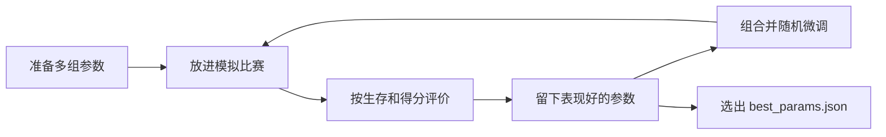
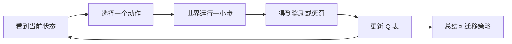

# 竞争生存游戏 (Competitive Survival)

在这个游戏中，你将编写一个 **Creature（生物）** 的 AI，放入 2D 世界中与其他生物竞争。世界中随机出现食物，生物需要抢食物、吃掉比自己小的对手、繁殖后代。**5000 tick 后，存活数量最多的物种获胜。**

## AI 助手使用要求

如果使用 opencode 或其他 AI 助手带学生完成课堂实践，开始前必须先读取并遵循根目录的 `agent.md`。AI 助手应按其中的课堂教练流程引导学生观察、选择技术路线、优化验证和发布署名，而不是直接替学生完成一个生物。

AI 助手的第一句话应该是教学引导问题，而不是直接写代码。学生需要亲自提供观察、选择或批准技术路线、检查结果，并确认最终生物名称和作者署名。

## 课堂实验探索流程

一节课只完成一个小循环：**观察一个现象，选择一条路线，验证一个改动，发布一个有署名的生物**。

### 1. 观察现象

先运行游戏，观察已有生物或自己的生物：

```bash
python3 main.py
```

把观察写具体，例如：

```text
我观察到 Grazer 看到近处生物会逃跑，但有时错过食物。
我观察到 Hunter 会追小生物，但容易追进更大生物附近。
我自己的生物会找食物，但繁殖太早，后代很快饿死。
```

在观察说清楚之前，不急着写代码。一个好观察至少包含：看到了哪种生物、发生在什么场景、你猜是什么原因、怎样才算改进。

### 2. 选择技术路线

观察明确后，从三条路线中选一条。

| 路线 | 适合场景 | 产出 |
|------|----------|------|
| 规则行为 | 你能用自然语言说出“看到 X 就做 Y” | 修改 `decide(perception)` 里的一个可解释规则 |
| GA 参数优化 | 行为结构已经合理，但速度、视野、繁殖阈值等数字需要调优 | 训练参数，比较旧值和新值，再选择要保留的参数 |
| Q-learning 策略探索 | 想探索找食物、逃跑、追击、漫步、繁殖等高层动作取舍 | 训练 `LearningCreature` 策略，再把有用想法迁移回自己的生物 |

GA 需要目标生物继承 `EvolvableCreature` 并定义基因；如果还不是可训练生物，应先把这件事作为 setup 步骤说明清楚。当前 RL 训练的是 `LearningCreature` 高层策略实验，不会直接重写任意学生生物文件。

#### GA 参数优化：像选拔一组更好的参数

GA（遗传算法）不负责发明整套行为规则。它更适合回答这样的问题：**这个规则已经能跑了，但速度、视野、逃跑距离、繁殖阈值这些数字调多少更好？**

可以这样向学生解释：

```text
我们先准备很多组参数，让它们分别上场比赛。
表现好的参数留下来，表现差的淘汰。
留下来的参数互相组合，再加一点随机小变化。
重复几代后，我们选一组最符合观察目标的参数。
```



课堂重点不是“分数最高就一定最好”，而是把参数变化和原始观察联系起来：例如速度变快是否真的更容易抢食物，繁殖阈值变高是否真的减少了小后代被吃掉。

#### Q-learning：像用小表格记住哪种动作更值得做

Q-learning 不直接写出一个完整生物文件。当前项目里，它训练 `LearningCreature` 在一些高层状态下选择动作，例如找食物、逃离威胁、追击猎物、漫步或繁殖。

可以这样向学生解释：

```text
生物先看自己处在什么状态。
它从几个高层动作里选一个。
世界给它反馈：能量变多、活得更久、逃过危险，就是好反馈。
它把这次经验记进一张 Q 表。
下次遇到类似状态，就更倾向选高分动作。
```



课堂重点是读出“策略倾向”，不是让学生背公式。比如：当附近有更大威胁时，表格可能学到“逃跑”比“追击”更值得；再把这个想法迁移回学生自己的 `decide()` 规则。

### 3. 优化与验证

每轮只做一个聚焦改动，用同一种语言记录证据：

```text
现象：
假设：
本轮改动：
验证方式：
观察结果：
下一轮建议：
```

验证可以来自可视化运行、训练输出或二者组合。结果变差也算有效证据，先解释为什么假设失败，再决定下一轮。

### 4. 发布署名

最终生物需要能被别人复现和讲清楚。建议在学生自己的 `creatures/*.py` 文件顶部记录：

```python
# Creature: <UniqueCreatureName>
# Author: <Student Name>
# Route: rule-based | genetic algorithm | q-learning
# Notes: <one short validation result>
```

发布前确认：生物名唯一、作者是学生自己的名字、有行为说明、有技术路线、有验证记录，并且别人能用同样命令或观察步骤复现。

## 快速开始

### 环境检查

```bash
python3 --version
python3 -c "import pygame; print(pygame.version.ver)"
```

如果你的本地环境明确使用 `python` 而不是 `python3`，再把下面命令里的 `python3` 换成 `python`。

### 运行游戏

```bash
python3 main.py
```

### 运行训练实验

当前已实现两种训练方法，可以独立运行，互不作为前置条件。课堂默认让训练在前台运行，让学生看到进度；只有学生明确想加快或后台并行时，才切换到后台/非可视化方式。

```bash
# GA：训练学生自己写的 EvolvableCreature 参数
python3 train.py --method ga --creature creatures/<student_creature>.py --generations 20 --history-output ga_history.json --output best_params.json

# RL：用离散 Q-learning 学习高层动作策略
python3 train.py --method rl --episodes 200 --output best_policy.json
```

GA 输出 `best_params.json`，可选输出 `ga_history.json`；RL 输出 `best_policy.json`。训练后要回到可视化游戏里做前后对比。GEP 规则生成仍在设计文档阶段，当前 `train.py` 暂不支持 `--method gep`。

### 操作

| 按键 | 功能 |
|------|------|
| SPACE | 暂停 / 继续 |
| R | 重新开始 |
| ESC | 退出 |

---

## 你的任务

在 `creatures/` 目录下新建一个 `.py` 文件，定义一个继承自 `Creature` 的类，实现 `decide()` 方法。重启游戏后你的生物会自动加入竞争。

开始写之前，先完成一次观察和路线选择。这个模板适合规则行为路线；如果你选择 GA 或 RL，也可以先从一个可读规则版本开始，再把调参结果或策略想法迁移回来。

### 最小模板

把以下代码保存为 `creatures/my_creature.py`：

```python
from __future__ import annotations
import math
import os
import sys
sys.path.insert(0, os.path.dirname(os.path.dirname(os.path.abspath(__file__))))
from creature import Creature, Perception, Action


# Creature: MyCreature
# Author: <Student Name>
# Route: rule-based
# Notes: baseline creature, moves straight for the first observation
class MyCreature(Creature):
    def __init__(self, x: float, y: float):
        super().__init__(x, y, "MyCreature", (255, 128, 0))

    def decide(self, perception: Perception) -> Action:
        return Action(perception.self_angle, self.max_speed)
```

这段代码创建了一个只会直线前进的橙色生物。你可以在此基础上逐步改进。

> **注意**：文件头部的 `sys.path` 那两行是必须的，确保能正确导入 `creature` 模块。
>
> 建议让类名和 `super().__init__()` 里的类型名保持一致，例如类名 `MyCreature` 对应 `"MyCreature"`。游戏现在也能处理二者不同的情况，但一致命名更方便在排行榜和日志里排查。

---

## 核心 API：decide()

每一帧，游戏引擎调用你的生物的 `decide(perception)` 方法。你根据感知信息返回一个 `Action`。

```python
def decide(self, perception: Perception) -> Action:
    ...
```

### Perception — 你能看到什么

| 字段 | 类型 | 说明 |
|------|------|------|
| `self_x` | `float` | 你当前的 X 坐标 |
| `self_y` | `float` | 你当前的 Y 坐标 |
| `self_angle` | `float` | 你当前的朝向（弧度，0 = 右，π/2 = 下） |
| `self_size` | `float` | 你当前的体型大小（随能量动态变化） |
| `self_energy` | `float` | 你当前的能量值 |
| `self_max_energy` | `float` | 你的初始能量值 |
| `world_width` | `int` | 世界宽度 |
| `world_height` | `int` | 世界高度 |
| `nearby_food` | `list[FoodSpot]` | 视野范围内的食物列表 |
| `nearby_creatures` | `list[CreatureSpot]` | 视野范围内的其他生物列表 |

#### FoodSpot

| 字段 | 类型 | 说明 |
|------|------|------|
| `x` | `float` | 食物 X 坐标 |
| `y` | `float` | 食物 Y 坐标 |
| `amount` | `float` | 食物的能量值 |
| `size` | `float` | 食物的大小 |

#### CreatureSpot

| 字段 | 类型 | 说明 |
|------|------|------|
| `x` | `float` | 对手 X 坐标 |
| `y` | `float` | 对手 Y 坐标 |
| `creature_type` | `str` | 对手的类型名（如 "Hunter", "MyCreature"） |
| `creature_id` | `int` | 对手的唯一 ID |
| `size` | `float` | 对手的体型大小 |
| `energy_pct` | `float` | 对手的能量占其初始能量的百分比 |

> 你只能看到 `vision_radius` 范围内的东西，范围外的世界不可见。

### Action — 你要做什么

每帧返回一个 `Action` 对象：

```python
Action(
    target_angle,       # float: 这一帧要朝向的角度（弧度）
    target_speed,       # float: 这一帧的移动速度（不超过 max_speed）
    attack_target_id,   # int | None: 要追击的生物 ID（仅用于标记意图）
    reproduce,          # bool: 是否繁殖（默认 False）
)
```

- **移动**：每帧必须指定 `target_angle` 和 `target_speed`。设 `0` 表示停止。
- **攻击**：碰到比自己**小**的生物会自动吃掉，无需主动声明攻击。`attack_target_id` 用于标记追击意图。
- **繁殖**：设 `reproduce=True` 且满足条件时，会在附近生成一个同类型子代。

如果你的 `decide()` 抛出异常，或者返回的不是合法 `Action`，游戏不会崩溃；该生物本帧会停止移动，终端会打印一条 warning。非法角度和速度也会被清洗：角度必须是有限数字，速度会限制在 `0 ~ max_speed`。

---

## 属性系统

你的生物在构造函数中通过 `creature_type` 关联属性配置。你也可以在 `__init__` 中手动覆盖：

```python
class MyCreature(Creature):
    def __init__(self, x, y):
        super().__init__(x, y, "MyCreature", (255, 128, 0))
        self.max_speed = 2.5
        self.vision_radius = 180.0
```

### 可配置属性

| 属性 | 默认值 | 最小值 | 最大值 | 说明 |
|------|--------|--------|--------|------|
| `max_speed` | 1.0 | 0.5 | 4.0 | 最大移动速度（像素/帧） |
| `max_energy` | 100.0 | 30.0 | 200.0 | 初始能量值 |
| `vision_radius` | 20.0 | 50.0 | 300.0 | 视野半径（像素） |
| `color` | 灰色 | — | — | 显示颜色 `(R, G, B)` |

> 超出范围的属性值会在生成时自动截断到边界内。

### 点数系统

所有生物共享一个 **总预算上限 = 1.5**。每个属性根据其值归一化到 0~1，三项属性的归一化值之和不能超过 1.5。

```
归一化值 = (属性值 - 最小值) / (最大值 - 最小值)
总点数   = 各属性归一化值之和
```

如果总点数超过 1.5，所有属性会**等比例缩小**。你无法全项拉满——**必须取舍**。

内置生物的点数分配：

| 类型 | 速度 | 能量 | 视野 | 总计 |
|------|------|------|------|------|
| Hunter | 0.57 | 0.29 | 0.60 | 1.46 |
| Grazer | 0.29 | 0.41 | 0.40 | 1.10 |
| PackHunter | 0.49 | 0.29 | 0.40 | 1.18 |
| Scavenger | 0.86 | 0.18 | 0.44 | 1.48 |

### 属性权衡

- **高速度 + 大视野** → 快速找到食物，但能量消耗大
- **高能量** → 初始体型大，能吃更多食物和小生物，但也更容易被更大的生物盯上
- **速度最关键** → 能吃到食物就能长大，长大就能吃别人，是滚雪球的核心

---

## 吃人规则（大吃小）

**没有攻击力和防御力**。战斗规则很简单：

1. **大吃小**：当一个生物碰到比自己**体型小**的生物时，直接吃掉
2. **获得全部能量**：吃掉对手后获得对方剩余的全部能量
3. **碰撞范围**：两个生物的中心距离 < `max((eater.size + target.size) × 0.6, eater.size - target.size)`，避免小生物贴边时明明被大生物覆盖却吃不到
4. **10 帧冷却**：吃掉一个生物后需等 10 帧才能再吃

### 体型公式

```
size = 6 × sqrt(energy / 100)
```

| 能量 | 体型 |
|------|------|
| 50 | 4.2 |
| 100 | 6.0 |
| 200 | 8.5 |
| 500 | 13.4 |
| 1000 | 19.0 |
| 5000 | 42.4 |

能量越高体型越大，能吃掉更多的生物，但也意味着**更大的碰撞范围**（更容易被更大的生物碰到）。

---

## 繁殖机制

每个生物可以自行决定何时繁殖。在你的 `decide()` 中返回 `Action(..., reproduce=True)` 即可。

### 繁殖条件

| 条件 | 值 |
|------|------|
| 能量阈值 | ≥ max_energy × 2.0 |
| 繁殖消耗 | max_energy × 0.5 |
| 繁殖冷却 | 120 帧 |
| 子代出现位置 | 母体周围随机 20px |
| 世界生物上限 | 600 |

### 繁殖流程

1. 生物决定繁殖（`reproduce=True`）
2. 检查能量是否 ≥ max_energy × 2
3. 检查繁殖冷却是否为 0
4. 扣除 max_energy × 0.5 的能量
5. 在附近生成一个同类型子代，初始能量 = 消耗的能量
6. 进入 120 帧冷却
7. 得 100 分

### 繁殖策略

- **早生 vs 晚生**：能量刚到阈值就生，子代小但数量多；攒更多能量再生，子代更大更安全
- **时机选择**：周围没有天敌时繁殖更安全；战斗激烈时繁殖可能送人头
- **种群控制**：世界有 600 生物上限，满了就无法繁殖

---

## 能量规则

能量是生存的核心。能量降到 0 你就死了。

### 能量消耗（每帧）

| 来源 | 公式 |
|------|------|
| 基础衰减 | 0.1 × (当前体型 / 6) |
| 移动消耗 | 额外 0.08 × (速度 / max_speed) × (体型 / 6) |

**体型越大，能量消耗越高**。这是一个关键的平衡机制——长到巨大并不总是好事，你需要不断进食来维持体型。

### 能量恢复

| 来源 | 效果 |
|------|------|
| 吃食物 | + 食物的 amount（8~100） |
| 吃掉对手 | + 对手剩余的全部能量 |
| 繁殖子代 | - max_energy × 0.5 |

### 吃食物条件

- 你与食物的距离 < 你的体型 + 3

---

## 胜利条件

游戏在 **5000 tick** 时结束（或更早，如果只剩一种生物存活）。获胜者为：

1. 如果只剩一种生物 → 该物种中能量最高的个体获胜
2. 如果到时间限制 → **存活数量最多的物种**中能量最高的个体获胜

---

## 计分规则

排行榜按分数从高到低排序：

| 事件 | 得分 |
|------|------|
| 吃掉对手 | + 对手的 max_energy |
| 吃食物 | + 食物的 amount（取整） |
| 繁殖后代 | + 100 |
| 最终获胜 | + 500 |

---

## 内置对手分析

### Hunter（红色 🔴）

| 属性 | 值 |
|------|------|
| max_speed | 2.5 |
| max_energy | 80 |
| vision_radius | 200 |

**行为**：追猎视野内最弱的生物（优先低血量），能量充足时繁殖。低能量时转而找食物。

**弱点**：初始能量低（80），前期容易被更大的生物吃掉。

### Grazer（绿色 🟢）

| 属性 | 值 |
|------|------|
| max_speed | 1.5 |
| max_energy | 100 |
| vision_radius | 150 |

**行为**：以吃食物为主，敌人接近到 35px 时逃跑。能量超过 2.5 倍初始值时繁殖。

**弱点**：速度最慢，前期容易被追上吃掉。

### PackHunter（蓝色 🔵）

| 属性 | 值 |
|------|------|
| max_speed | 2.2 |
| max_energy | 80 |
| vision_radius | 150 |

**行为**：寻找同伴，聚在一起时主动围猎敌人。附近同类少于 5 个且能量充足时繁殖。落单时逃跑。

**弱点**：初始能量低，早期容易被各个击破。

### Scavenger（黄色 🟡）

| 属性 | 值 |
|------|------|
| max_speed | 3.5 |
| max_energy | 60 |
| vision_radius | 160 |

**行为**：全场最快，抢到食物就跑。能量超过 3 倍初始值时繁殖。从不主动攻击。

**弱点**：初始能量最低（60），前期体型最小，谁都能吃它。

---

## 策略提示

1. **滚雪球型**：前期专注吃食物快速长大，体型大了就能吃别人，越吃越大。

2. **速繁殖型**：尽快攒够能量繁殖，靠数量优势取胜。但子代小容易被吃。

3. **猎人型**：高速度 + 大视野，专门追杀比自己小的生物。食物只是辅助。

4. **伏击型**：躲在食物附近，等对手来吃食物时（它也变大了可能比你小）突然吃掉。

5. **种群策略**：设计繁殖时机，让同族在后期占据数量优势赢得胜利。

6. **能量管理**：体型越大消耗越高。没有食物来源时，适当"减肥"（停止进食让能量下降）可能比维持巨大体型更持久。

7. **针对性克制**：Scavenger 在 80px 内逃跑，Grazer 在 35px 内逃跑。在逃跑触发距离外接近它们。

---

## 提交方式

将你的 `.py` 文件放入 `creatures/` 目录即可。满足：

1. 文件位于 `creatures/` 目录下（不要以 `_` 开头）
2. 定义一个继承 `Creature` 的类
3. 实现了 `decide(self, perception: Perception) -> Action` 方法
4. 构造函数签名为 `__init__(self, x: float, y: float)`
5. 文件顶部记录唯一生物名、学生作者、技术路线和验证说明

游戏启动时会自动扫描 `creatures/` 目录，加载所有合法的 Creature 子类。每个类会生成相同数量的初始实例。

如果一个 `.py` 文件里定义了多个合法 Creature 子类，它们都会加入比赛，终端会打印 warning。课堂提交时建议一个文件只保留一个参赛类，避免旧实验类意外参赛。

提交说明里请附上可复现的验证方式，例如 `python3 main.py` 的前后观察、GA 输出里的参数变化，或 RL 策略中值得迁移的一条高层动作规律。

---

## 常用代码片段

### 计算朝向某点的角度

```python
angle = math.atan2(target_y - perception.self_y, target_x - perception.self_x)
```

### 计算两点距离

```python
dist = math.hypot(target_x - perception.self_x, target_y - perception.self_y)
```

### 找最近的实体

```python
nearest = min(
    perception.nearby_creatures,
    key=lambda c: math.hypot(c.x - perception.self_x, c.y - perception.self_y),
)
```

### 远离某个方向（逃跑）

```python
flee_angle = math.atan2(
    perception.self_y - enemy.y,
    perception.self_x - enemy.x,
)
```

### 判断是否可以繁殖

```python
can_reproduce = perception.self_energy >= perception.self_max_energy * 2.0
```

### 随机漫步（无目标时）

```python
angle = perception.self_angle + math.sin(perception.self_x * 0.01) * 0.3
return Action(angle, self.max_speed * 0.5)
```

---

## 完整示例

下面三份示例分别对应三条课堂路线。课堂提交时不要同时复制三份到一个文件里；请选择和你本轮实验一致的一种。

### 示例 A：基于规则的 Creature

适合路线：学生能说清楚“看到 X 就做 Y”。这个版本不需要训练文件，直接放进 `creatures/rule_survivor.py` 后运行 `python3 main.py` 观察。

```python
from __future__ import annotations
import math
import os
import sys
sys.path.insert(0, os.path.dirname(os.path.dirname(os.path.abspath(__file__))))
from creature import Creature, Perception, Action


# Creature: RuleSurvivor
# Author: <Student Name>
# Route: rule-based
# Notes: flee bigger creatures, chase smaller creatures, reproduce when rich
class RuleSurvivor(Creature):
    def __init__(self, x: float, y: float):
        super().__init__(x, y, "RuleSurvivor", (255, 128, 0))
        self.max_speed = 2.2
        self.max_energy = 100.0
        self.energy = 100.0
        self.vision_radius = 160.0

    def decide(self, perception: Perception) -> Action:
        energy_pct = perception.self_energy / perception.self_max_energy

        if energy_pct >= 2.5:
            return Action(perception.self_angle, 0, reproduce=True)

        if perception.nearby_creatures:
            smaller = [c for c in perception.nearby_creatures if c.size < perception.self_size]
            if smaller:
                target = min(smaller,
                    key=lambda c: math.hypot(c.x - perception.self_x, c.y - perception.self_y))
                angle = math.atan2(target.y - perception.self_y, target.x - perception.self_x)
                return Action(angle, self.max_speed)

            bigger = [c for c in perception.nearby_creatures if c.size > perception.self_size]
            if bigger:
                nearest_big = min(bigger,
                    key=lambda c: math.hypot(c.x - perception.self_x, c.y - perception.self_y))
                dist = math.hypot(nearest_big.x - perception.self_x, nearest_big.y - perception.self_y)
                if dist < 60:
                    flee = math.atan2(perception.self_y - nearest_big.y, perception.self_x - nearest_big.x)
                    return Action(flee, self.max_speed)

        if perception.nearby_food:
            food = min(perception.nearby_food,
                key=lambda f: math.hypot(f.x - perception.self_x, f.y - perception.self_y))
            angle = math.atan2(food.y - perception.self_y, food.x - perception.self_x)
            return Action(angle, self.max_speed * 0.7)

        angle = perception.self_angle + math.sin(perception.self_x * 0.015) * 0.2
        return Action(angle, self.max_speed * 0.4)
```

这个 `RuleSurvivor` 的策略：
- **能量充足时繁殖**，扩大种群
- **追杀比自己小的对手**，不吃亏
- **远离比自己大的对手**，保命优先
- **空闲时**找食物或随机漫步

### 示例 B：基于 GA 调参的 Creature

适合路线：规则结构已经确定，但想让 GA 帮你搜索速度、视野、逃跑距离、繁殖阈值等数字。保存为 `creatures/gene_tuned_survivor.py` 后，可以运行：

```bash
python3 train.py --method ga --creature creatures/gene_tuned_survivor.py --generations 20 --history-output ga_history.json --output best_params.json
```

训练后，把 `best_params.json` 中你认可的参数填回 `default_genes`，再运行 `python3 main.py` 做前后对比。

```python
from __future__ import annotations
import math
import os
import sys
sys.path.insert(0, os.path.dirname(os.path.dirname(os.path.abspath(__file__))))
from creature import Perception, Action
from evolvable import EvolvableCreature


# Creature: GeneTunedSurvivor
# Author: <Student Name>
# Route: genetic algorithm
# Notes: GA tunes movement, vision, flee, food, and reproduction numbers
class GeneTunedSurvivor(EvolvableCreature):
    gene_defs = {
        "max_speed": (1.4, 3.2),
        "max_energy": (70.0, 140.0),
        "vision_radius": (120.0, 240.0),
        "flee_distance": (35.0, 100.0),
        "reproduce_ratio": (2.0, 3.2),
        "food_speed_ratio": (0.45, 1.0),
        "wander_turn": (0.08, 0.45),
    }

    default_genes = {
        "max_speed": 2.2,
        "max_energy": 100.0,
        "vision_radius": 170.0,
        "flee_distance": 60.0,
        "reproduce_ratio": 2.5,
        "food_speed_ratio": 0.75,
        "wander_turn": 0.2,
    }

    def __init__(self, x: float, y: float, genes=None):
        super().__init__(
            x,
            y,
            genes=genes or self.default_genes,
            creature_type="GeneTunedSurvivor",
            color=(80, 210, 255),
        )

    def decide(self, perception: Perception) -> Action:
        energy_ratio = perception.self_energy / perception.self_max_energy

        threats = [c for c in perception.nearby_creatures if c.size > perception.self_size]
        if threats:
            nearest = min(threats, key=lambda c: self._dist(perception, c.x, c.y))
            if self._dist(perception, nearest.x, nearest.y) < self.genes["flee_distance"]:
                angle = math.atan2(perception.self_y - nearest.y, perception.self_x - nearest.x)
                return Action(angle, self.max_speed)

        if energy_ratio >= self.genes["reproduce_ratio"] and not threats:
            return Action(perception.self_angle, 0.0, reproduce=True)

        prey = [c for c in perception.nearby_creatures if c.size < perception.self_size]
        if prey:
            target = min(prey, key=lambda c: self._dist(perception, c.x, c.y))
            angle = math.atan2(target.y - perception.self_y, target.x - perception.self_x)
            return Action(angle, self.max_speed, attack_target_id=target.creature_id)

        if perception.nearby_food:
            food = max(
                perception.nearby_food,
                key=lambda f: f.amount / (self._dist(perception, f.x, f.y) + 10.0),
            )
            angle = math.atan2(food.y - perception.self_y, food.x - perception.self_x)
            return Action(angle, self.max_speed * self.genes["food_speed_ratio"])

        angle = perception.self_angle + math.sin(perception.self_x * 0.01) * self.genes["wander_turn"]
        return Action(angle, self.max_speed * 0.45)

    def _dist(self, perception: Perception, x: float, y: float) -> float:
        return math.hypot(x - perception.self_x, y - perception.self_y)
```

这个 `GeneTunedSurvivor` 的重点：
- `gene_defs` 是 GA 可以搜索的数字范围
- `default_genes` 是当前默认参数，也可以填入训练后的结果
- `decide()` 仍然是可读规则，GA 只是调数字，不替学生解释行为

### 示例 C：基于 RL/Q-learning 策略表的 Creature

适合路线：先用 RL 探索高层动作，再把训练出的 `best_policy.json` 当作策略表读取。先运行：

```bash
python3 train.py --method rl --episodes 200 --output best_policy.json
```

再把下面代码保存为 `creatures/policy_table_survivor.py`。如果找不到 `best_policy.json`，它会退回随机漫步，不让课堂演示崩掉。

```python
from __future__ import annotations
import math
import os
import sys
sys.path.insert(0, os.path.dirname(os.path.dirname(os.path.abspath(__file__))))
from creature import Creature, Perception, Action
from training.policy import decode_action, discrete_state_key, encode_features
from training.rl import load_q_policy


# Creature: PolicyTableSurvivor
# Author: <Student Name>
# Route: q-learning
# Notes: reads best_policy.json and uses the highest-value action per state
class PolicyTableSurvivor(Creature):
    _policy = None

    def __init__(self, x: float, y: float):
        super().__init__(x, y, "PolicyTableSurvivor", (190, 120, 255))
        self.max_speed = 2.2
        self.max_energy = 90.0
        self.energy = self.max_energy
        self.vision_radius = 180.0

        if PolicyTableSurvivor._policy is None:
            root = os.path.dirname(os.path.dirname(os.path.abspath(__file__)))
            policy_path = os.path.join(root, "best_policy.json")
            try:
                PolicyTableSurvivor._policy = load_q_policy(policy_path)
            except FileNotFoundError:
                PolicyTableSurvivor._policy = False

    def decide(self, perception: Perception) -> Action:
        policy = PolicyTableSurvivor._policy
        if policy:
            features = encode_features(perception)
            state = discrete_state_key(features)
            action_name = policy.select_action(state, explore=False)
            return decode_action(action_name, perception, self)

        # Fallback when best_policy.json has not been trained yet.
        if perception.nearby_food:
            food = min(
                perception.nearby_food,
                key=lambda f: math.hypot(f.x - perception.self_x, f.y - perception.self_y),
            )
            angle = math.atan2(food.y - perception.self_y, food.x - perception.self_x)
            return Action(angle, self.max_speed * 0.7)

        turn = math.sin(perception.self_x * 0.013 + perception.self_y * 0.007) * 0.45
        return Action(perception.self_angle + turn, self.max_speed * 0.45)
```

这个 `PolicyTableSurvivor` 的重点：
- RL 训练结果在 `best_policy.json`，不是直接写进生物文件
- 生物每帧把当前场景编码成一个状态，从 Q 表里选分数最高的动作
- 课堂解释要回到行为语言：例如“有大威胁时更倾向逃跑”，不要只展示一堆表格数字

---

祝你好运，让你的物种统治这个世界！
